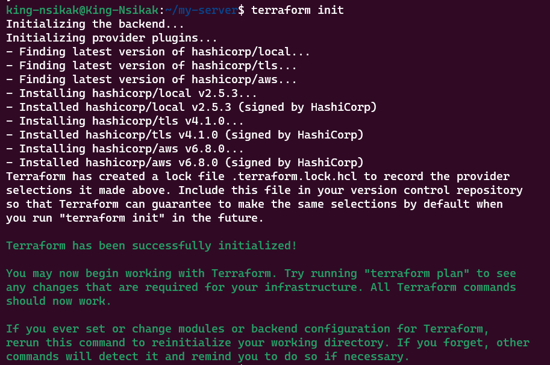
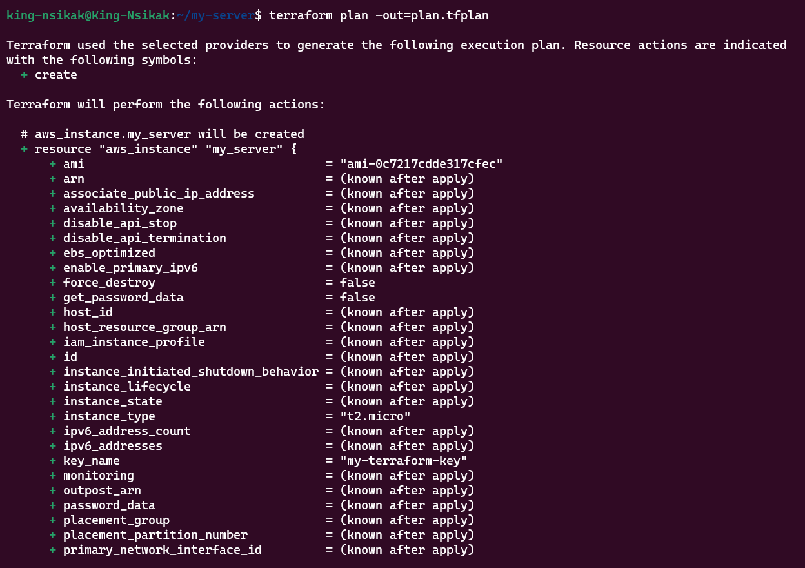

# LAMP Stack Deployment on AWS EC2

## Introduction
The **LAMP stack** represents a powerful web development platform comprising four essential components:
- **L**inux – Server operating system
- **A**pache – HTTP web server
- **M**ySQL/MariaDB – Relational database management system  
- **P**HP – Server-side scripting language

This comprehensive guide walks you through deploying a complete LAMP stack on an Amazon EC2 instance using Ubuntu Linux.

---

## Initial Requirements
Before beginning the deployment, verify you have:
1. An active **AWS Account** with appropriate permissions
2. **Terraform** installed on your local machine (version >= 1.0)
3. **AWS CLI** configured with valid credentials
4. An **SSH key pair** generated on your local machine
5. Familiarity with **Linux command-line operations**
6. SSH client (Linux/Mac Terminal, Windows Subsystem for Linux, or PuTTY)

### Prerequisites Setup
If you haven't already, install and configure the required tools:

#### Install Terraform:
```bash
# For Ubuntu/Debian
wget -O- https://apt.releases.hashicorp.com/gpg | sudo gpg --dearmor -o /usr/share/keyrings/hashicorp-archive-keyring.gpg
echo "deb [signed-by=/usr/share/keyrings/hashicorp-archive-keyring.gpg] https://apt.releases.hashicorp.com $(lsb_release -cs) main" | sudo tee /etc/apt/sources.list.d/hashicorp.list
sudo apt update && sudo apt install terraform

# For macOS (using Homebrew)
brew tap hashicorp/tap
brew install hashicorp/tap/terraform

# For Windows (using Chocolatey)
choco install terraform
```

#### Configure AWS CLI:
```bash
aws configure
# Enter your AWS Access Key ID, Secret Access Key, region, and output format
```

#### Generate SSH Key Pair (if needed):
```bash
ssh-keygen -t rsa -b 4096 -f ~/.ssh/lamp-stack-key
# This creates lamp-stack-key (private) and lamp-stack-key.pub (public)
```

---

## Complete Implementation Guide

### Phase 1: EC2 Instance Provisioning with Terraform
Create and deploy your EC2 instance using Infrastructure as Code (Terraform) for better reproducibility and version control.

#### Terraform Configuration Files
Create a new directory for your Terraform configuration:
```bash
mkdir lamp-stack-terraform
cd lamp-stack-terraform
```

Create the main Terraform configuration file `main.tf`:
```hcl
# Simple EC2 instance with Terraform
provider "aws" {
  region = "us-east-2"
}

# Generate a private key
resource "tls_private_key" "my_key" {
  algorithm = "RSA"
  rsa_bits  = 2048
}

# Create a key pair in AWS
resource "aws_key_pair" "my_key" {
  key_name   = "my-terraform-key"
  public_key = tls_private_key.my_key.public_key_openssh
}

# Save private key to a file
resource "local_file" "private_key" {
  filename        = "nsikak-key.pem"
  content         = tls_private_key.my_key.private_key_pem
  file_permission = "0600"
}

# Create an EC2 instance
resource "aws_instance" "my_server" {
  ami           = "ami-0d1b5a8c13042c939" # Ubuntu 24.04 LTS
  instance_type = "t3.micro"
  key_name      = aws_key_pair.my_key.key_name

  tags = {
    Name = "my-ubuntu-server"
  }
}

# Output the public IP
output "public_ip" {
  value = aws_instance.my_server.public_ip
}

```

#### Deploy the Infrastructure
1. Initialize Terraform in your project directory:
```bash
terraform init
```


2. Review the planned changes:
```bash
terraform plan -out=plan.tfplan
```
The -out flag is used with terraform plan to save the execution plan to a file



3. Apply the configuration to create resources:
```bash
terraform apply -auto-approve plan.tfplan
```
The -auto-approve flag is used with terraform apply to skip the interactive approval prompt.


4. Once deployment completes, note the output values including your instance's public IP address.

5. Verify the instance is running in the AWS Console or retrieve the public IP:
```bash
terraform output instance_public_ip
```

---
Alternatively, retrieve your public IP address using the AWS metadata service:
```bash
TOKEN=`curl -X PUT "http://169.254.169.254/latest/api/token" -H "X-aws-ec2-metadata-token-ttl-seconds: 21600"` && curl -H "X-aws-ec2-metadata-token: $TOKEN" -s http://169.254.169.254/latest/meta-data/public-ipv4
```
### Phase 2: Connecting to Your EC2 instance
Configure inbound rules to allow SSH connection


Connect to the EC@ instace
```bash
 ssh -i "<your-key.pem>" ubuntu@ec2-3-144-194-207.us-east-2.compute.amazonaws.com
```
Successful connection is indicated by the Ubuntu command prompt.
---

---
---

---


### Phase 3: System Update and Maintenance
Update your system packages to ensure security and stability:
```bash
sudo apt update && sudo apt upgrade -y
```

---

### Phase 4: Apache Web Server Installation
Install the Apache HTTP server:
```bash
sudo apt install apache2 -y
```
Configure Apache to start automatically and launch the service:
```bash
sudo systemctl enable apache2
sudo systemctl start apache2
```
---
Verify Apache is running correctly with status verification:
```bash
sudo systemctl status apache2
```
A green "active" status confirms successful installation.
---

---
Test web server functionality by accessing `http://<EC2_PUBLIC_IP>` in your browser.
---

---
Alternative testing methods using command-line tools:
```bash
curl http://localhost:80 
```
or
```bash
curl http://127.0.0.1:80
```
---

---

### Phase 5: MySQL Database Server Setup
Install the MySQL database server:
```bash
sudo apt install mysql-server -y
```
Confirm MySQL service status:
```bash
sudo systemctl status mysql
```
---

---
Access the MySQL console for initial configuration:
```bash
sudo mysql
```
You'll see the MySQL prompt indicating successful connection.
---

---
Configure the root user password with enhanced security:
```bash
ALTER USER 'root'@'localhost' IDENTIFIED WITH mysql_native_password BY 'PassWord.1'; 
```
Exit the MySQL session:
```bash
exit
```
Execute the security configuration script:
```bash
sudo mysql_secure_installation
```
The script will prompt you to configure password validation policies. Select 'y' to enable and choose your preferred security level.
---

---

---
Verify password-based authentication:
```bash
sudo mysql -p
```
Note: The -p flag prompts for the password you just configured.
Exit MySQL when finished:
```bash
exit
```

---

### Phase 6: PHP Installation and Configuration
Install PHP along with necessary Apache and MySQL extensions:
```bash
sudo apt install php libapache2-mod-php php-mysql -y
```
Verify the PHP installation:
```bash
php -v
```

---

### Phase 7: Apache Virtual Host Configuration
Create a dedicated directory for your web project:
```bash
sudo mkdir /var/www/projectlamp
```
Transfer ownership to your current user account:
```bash
sudo chown -R $USER:$USER /var/www/projectlamp
```
Create a new Apache configuration file for your virtual host:
```bash
sudo vi /etc/apache2/sites-available/projectlamp.conf
```
Press 'i' to enter insert mode and add the following configuration:
```apache
<VirtualHost *:80>
        ServerName projectlamp
        ServerAlias www.projectlamp
        ServerAdmin webmaster@localhost
        DocumentRoot /var/www/projectlamp
        ErrorLog ${APACHE_LOG_DIR}/error.log
        CustomLog ${APACHE_LOG_DIR}/access.log combined
</VirtualHost>
```
Save and exit by pressing Esc, then typing `:wq` and pressing Enter.

Note: The DocumentRoot directive tells Apache to serve content from `/var/www/projectlamp`.

Activate your new virtual host:
```bash
sudo a2ensite projectlamp
```
Disable the default Apache site:
```bash
sudo a2dissite 000-default
```
Test your configuration for syntax errors:
```bash
sudo apache2ctl configtest
```
Apply the configuration changes:
```bash
sudo systemctl reload apache2
```

Note: Lines in configuration files can be commented out using '#' at the beginning.

### Phase 8: PHP Functionality Testing
Create a test file in your web root directory:
```bash
sudo echo 'Hello LAMP from hostname ' $(TOKEN=`curl -X PUT "http://169.254.169.254/latest/api/token" -H "X-aws-ec2-metadata-token-ttl-seconds: 21600"` && curl -H "X-aws-ec2-metadata-token: $TOKEN" -s http://169.254.169.254/latest/meta-data/public-hostname) 'with public IP' $(TOKEN=`curl -X PUT "http://169.254.169.254/latest/api/token" -H "X-aws-ec2-metadata-token-ttl-seconds: 21600"` && curl -H "X-aws-ec2-metadata-token: $TOKEN" -s http://169.254.169.254/latest/meta-data/public-ipv4) > /var/www/projectlamp/index.html
```

Access your website at:
```
http://<EC2_PUBLIC_IP>:80
```

If you see your echo message, your Apache virtual host is functioning properly. Note that index.html takes precedence over other files due to default DirectoryIndex settings.

---

### Phase 9: PHP Processing Configuration
Modify the DirectoryIndex order to prioritize PHP files:
```bash
sudo vim /etc/apache2/mods-enabled/dir.conf
```
Change the existing line from:
```apache
DirectoryIndex index.html index.cgi index.pl index.php index.xhtml index.htm
```
To:
```apache
DirectoryIndex index.php index.html index.cgi index.pl index.xhtml index.htm
```
Save your changes and reload Apache:
```bash
sudo systemctl reload apache2
```

##### Create a PHP information page:
```bash
vim /var/www/projectlamp/index.php
```
Add this PHP code to display system information:
```php
<?php
phpinfo();
?>
```
This will display comprehensive PHP configuration details.

---

### Phase 10: Firewall Configuration (Optional)
If using UFW (Uncomplicated Firewall), configure appropriate rules:
```bash
sudo ufw allow OpenSSH
sudo ufw allow 'Apache Full'
sudo ufw enable
```

---

### Phase 11: Database Connectivity Testing
Create a PHP script to test MySQL connectivity:
```bash
sudo nano /var/www/projectlamp/db_test.php
```
Add the following connection test code:
```php
<?php
$servername = "localhost";
$username = "root";
$password = "your_mysql_password";

// Establish database connection
$conn = new mysqli($servername, $username, $password);

// Verify connection status
if ($conn->connect_error) {
  die("Connection failed: " . $conn->connect_error);
}
echo "Database connection successful";
?>
```
Test the connection by visiting:
```
http://<EC2_PUBLIC_IP>/db_test.php
```

---

## Common Issues and Solutions
| Problem | Resolution |
|---------|------------|
| Apache fails to start | Execute `sudo journalctl -xe` to examine system logs |
| PHP files download instead of executing | Verify `libapache2-mod-php` installation |
| MySQL authentication errors | Re-execute `mysql_secure_installation` |
| Port 80 inaccessible | Review AWS security group configurations |
| UFW blocking connections | Configure UFW to allow Apache traffic |

---

## Resource Cleanup
When you no longer require the LAMP stack:

### Using Terraform:
```bash
# Navigate to your terraform directory
cd lamp-stack-terraform

# Destroy all resources created by Terraform
terraform destroy
```
Type `yes` when prompted to confirm destruction.

### Manual cleanup (if needed):
- Review AWS Console to ensure all resources are terminated
- Check for any orphaned resources like security groups or key pairs

---

## System Architecture Overview


---
**Documentation Complete**